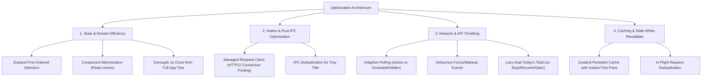

# ClickUp Lite: Performance & Efficiency Optimization Plan

This document outlines the optimization roadmap implemented to make **ClickUp Lite Control Panel** faster, more resource-efficient, battery-friendly, and responsive.

---

## 1. Executive Summary & Core Inefficiencies Identified

| Area                               | Inefficiency Addressed                                                                       | Impact                                                                       | Implemented Optimization                                                                                         |
| :--------------------------------- | :------------------------------------------------------------------------------------------- | :--------------------------------------------------------------------------- | :--------------------------------------------------------------------------------------------------------------- |
| **Zustand Reactivity**             | Store accessed without selectors (`useAppStore()`), re-rendering root on every second `tick` | High CPU & battery drain; entire task list re-renders every 1,000ms          | Atomic selectors (`useAppStore(s => s.prop)`) & micro-component memoization                                      |
| **Tauri Native IPC**               | `update_tray_title` IPC invoked every second even when title string hasn't changed           | Unnecessary IPC overhead, prevents macOS App Nap                             | Deduplicated IPC calls (cached tray title in memory)                                                             |
| **Rust HTTP Client**               | `reqwest::Client::new()` created on every API request in Rust                                | TLS handshake & TCP reconnect penalty on every call (+150-400ms per request) | Tauri Managed State `State<reqwest::Client>` with persistent HTTP/2 connection pooling & keep-alive              |
| **ClickUp API Polling**            | Background polling requests full today time entries every 15s even when window is hidden     | Wastes ClickUp rate limit (100 req/min limit) & background bandwidth         | Adaptive visibility polling: poll current timer only when hidden; 15s when visible; sync today's total on wakeup |
| **Request Concurrency & Debounce** | Window focus and rapid tray clicks trigger duplicate parallel requests                       | Request bursts, UI jitter, potential race conditions                         | In-flight request deduplication promises & 300ms focus debounce                                                  |
| **Task List & DOM**                | Re-filtering tasks inline in render pass without `useMemo`                                   | Minor layout churn on each render                                            | `useMemo` for filtered tasks, `React.memo` for `TaskRow`                                                         |

---

## 2. Implementation Architecture

---

## 3. Implementation Status & Checklist

- [x] **Step 1:** Refactor Zustand consumers across components to use atomic selectors (`useAppStore(s => s.x)`).
- [x] **Step 2:** Optimize Tauri Rust backend (`lib.rs`) with `tauri::State<reqwest::Client>` for HTTP connection pooling.
- [x] **Step 3:** Add IPC tray title deduplication (only send IPC when title string changes).
- [x] **Step 4:** Implement adaptive visibility-based polling (pause heavy queries when window is hidden).
- [x] **Step 5:** Add 300ms debounce to focus and window wake-up events to prevent request bursts.
- [x] **Step 6:** Add in-flight promise deduplication for `syncCurrentTimer`, `syncTodayTime`, and `fetchTasks`.
